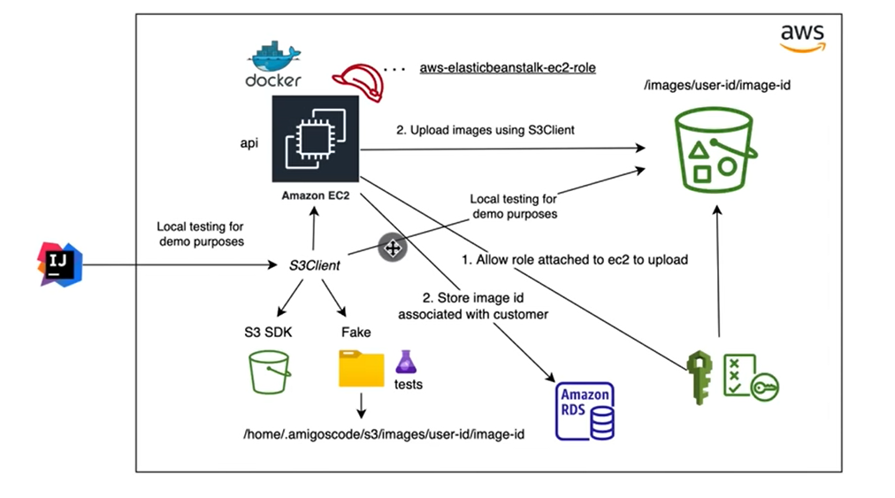
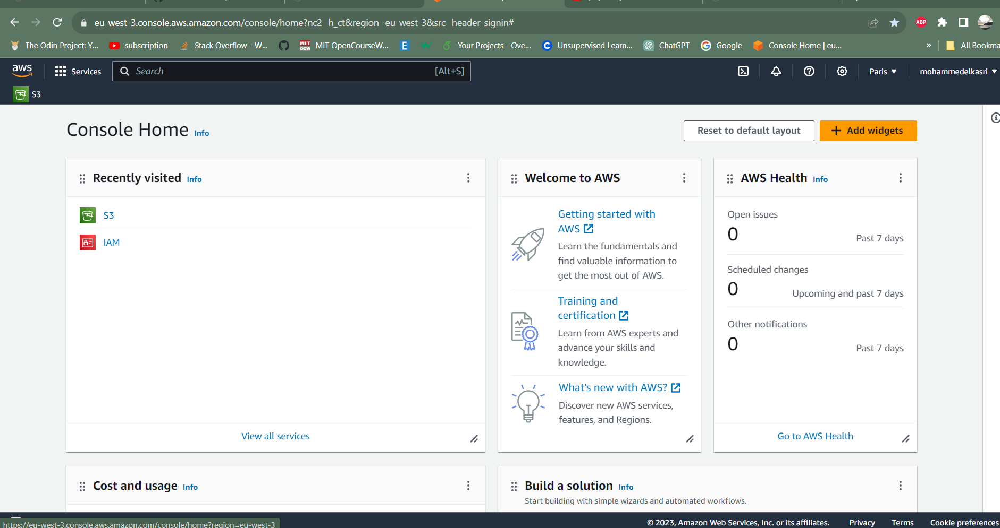
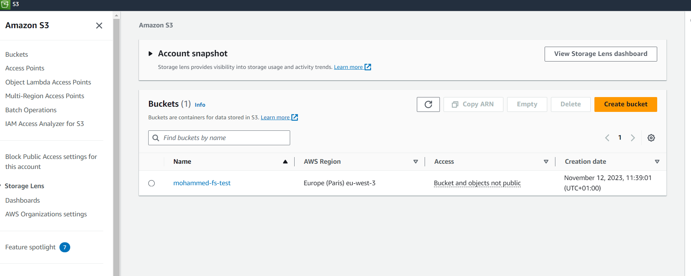

## fullstack-AWS with springboot, React, Docker, AWS, and Postgres
this project implements the ability of storing files using SpringBoot,React and AWS.

in this project we are using IntelliJ IDEA IDE (Ultimate) and the cloud provider AWS, this is the structure:

the bucket of S3 service provided by AWS in my account:

